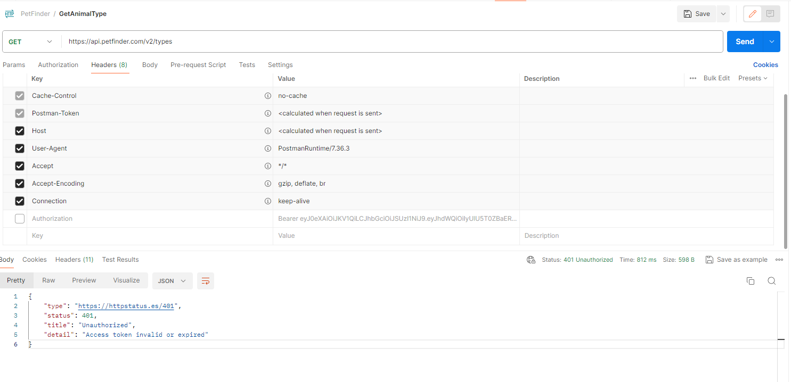
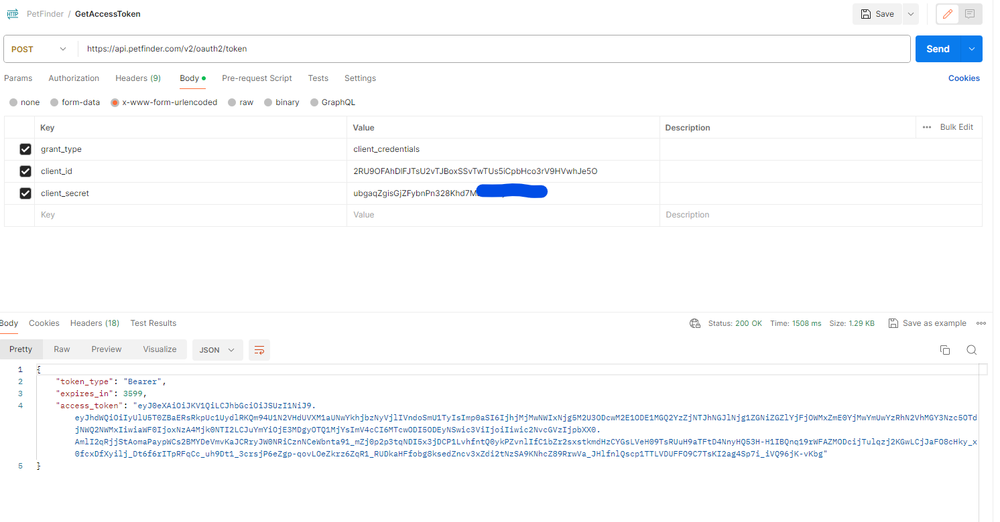
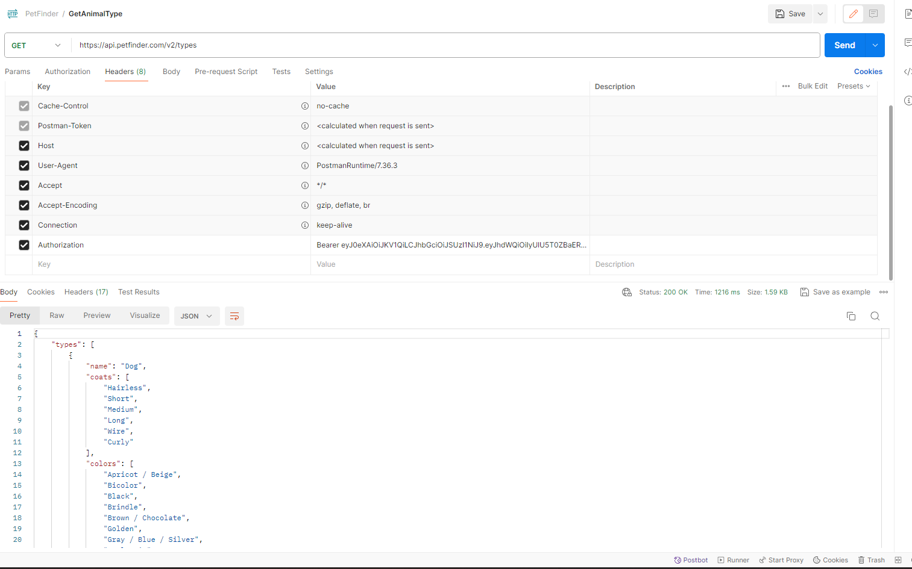
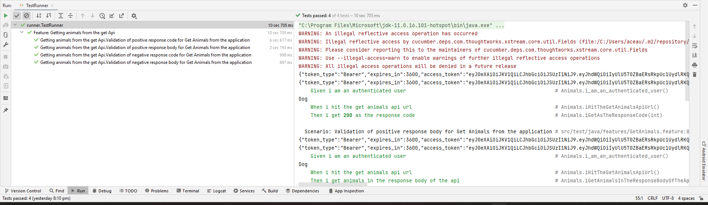
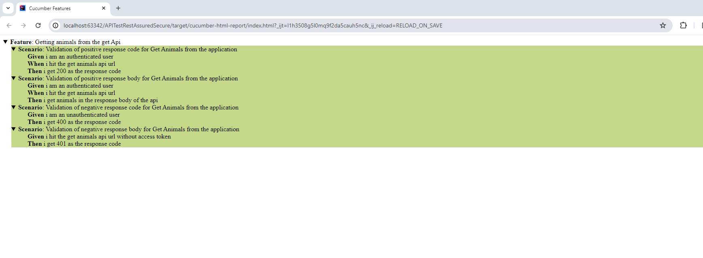

<h1 align="center"> API Testing of secure apis using getAccessToken/Authorization - Java - using Rest Assured & Cucumber libraries in Bdd framework - apis validation for positive and negative scenarios  </h1>  

  Description: This is a demo project on java tech for testing some real time sample apis to perform apis validation -with and without Authorization
 the apis used in this example is 
GET https://api.petfinder.com/v2/animals
and for getting the access token its
POST https://api.petfinder.com/v2/oauth2/token

## Table of Contents

- [Introduction](#introduction)
- [Features](#features)
- [Requirements](#requirements)
- [Quick Start](#quick-start)

## Introduction

## Manual Verification:

perform GET API (without Authorization) - validate response code and response body

POST API- getting Access token
POST:

perform GET API (with Authorization) - validate response code and response body
GET:

## Features
Get Animal: GET API
Get Access Token: POST API

## Test Requirements
The tests need to be validated for the response code returned back as well as the response body

### Local
* [Java 11 SDK](https://www.oracle.com/au/java/technologies/javase/jdk11-archive-downloads.html)
* [Maven](https://maven.apache.org/download.cgi)
* [ChromeDriver](https://chromedriver.chromium.org/downloads)

## Test Automation Verification:

<b>Test Runner results:</b>

<b>Cucumber html report</b>

